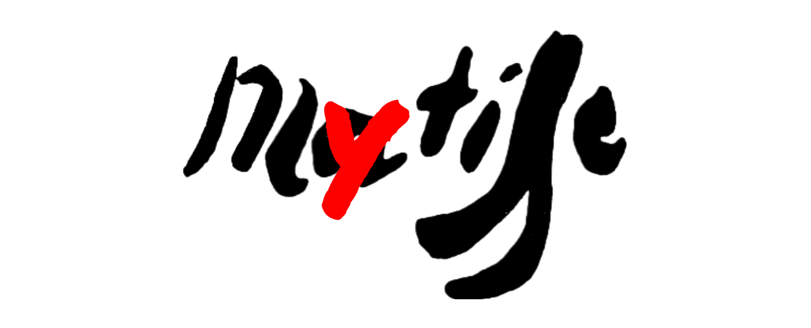

# MyTISSE 

This repository contains all the files related to my final thesis for the MA "Digital Humanities and Digital Knowledge" at the University of Bologna. 

<table>
<tr>
    <td><b>Title</b></td>
    <td>MyTISSE. Interactive systems as enhancement tools for the  sense of care in color perception. A case study on <i>Les demoiselles à la rivière</i> by Matisse</td>
</tr>
<tr>
    <td><b>Supervisor</b></td>
    <td>Prof Sofia Pescarin (UniBo - CNR)</td>
</tr>
<tr>
    <td><b>Co-supervisor</b></td>
    <td>Delfina Pandiani</td>
</tr>
<tr>
    <td><b>Subject</b></td>
    <td>Digital Heritage and Multimedia - Interaction Media Design</td>
</tr>
</table>

## Content

The repository contains different subfolder:
- `prototype` hosts the material which is being used to prepare the Unity 3D prototype. It will also contain the final prototype as Unity package;
- `data` collects the data obtained from the prototype testing (for now, the testing session held in Bologna, June 8th, 2023)

## License

Shield: [![CC BY 4.0][cc-by-shield]][cc-by]

This work is licensed under a
[Creative Commons Attribution 4.0 International License][cc-by].

[![CC BY 4.0][cc-by-image]][cc-by]

[cc-by]: http://creativecommons.org/licenses/by/4.0/
[cc-by-image]: https://i.creativecommons.org/l/by/4.0/88x31.png
[cc-by-shield]: https://img.shields.io/badge/License-CC%20BY%204.0-lightgrey.svg
